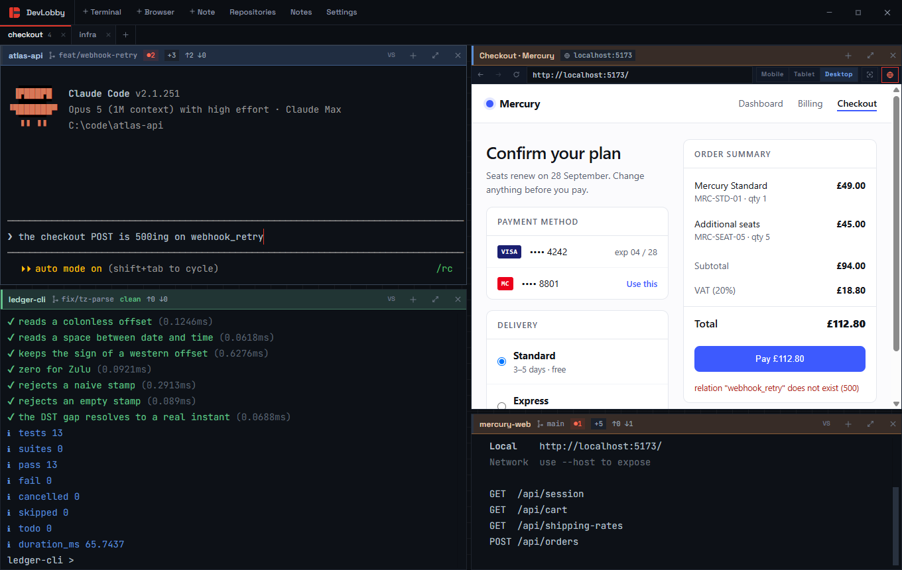
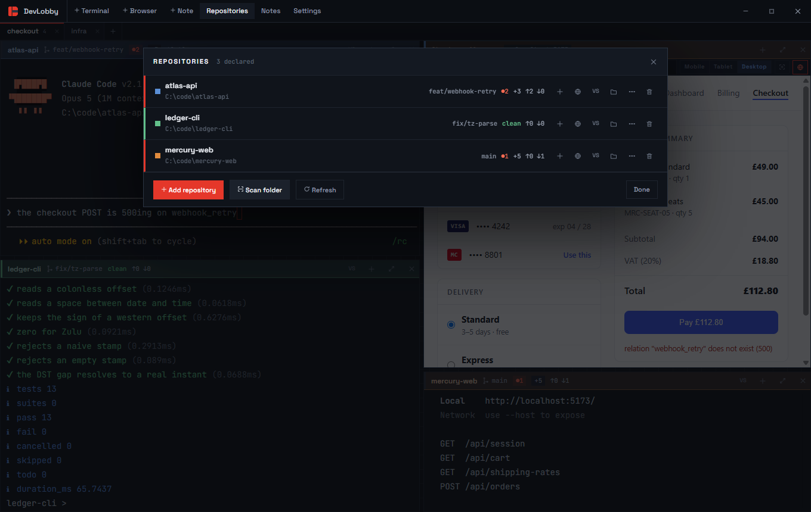
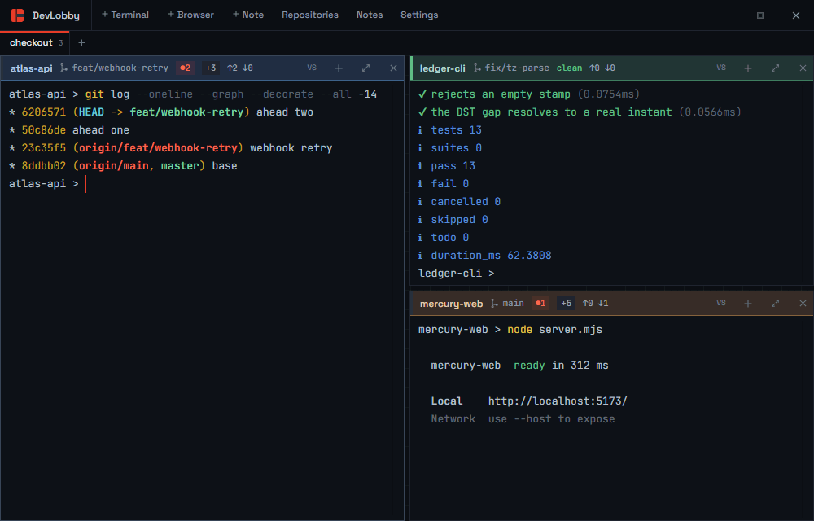
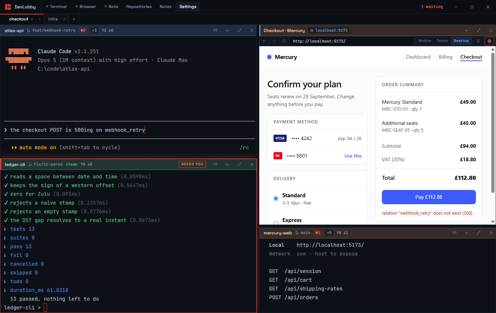
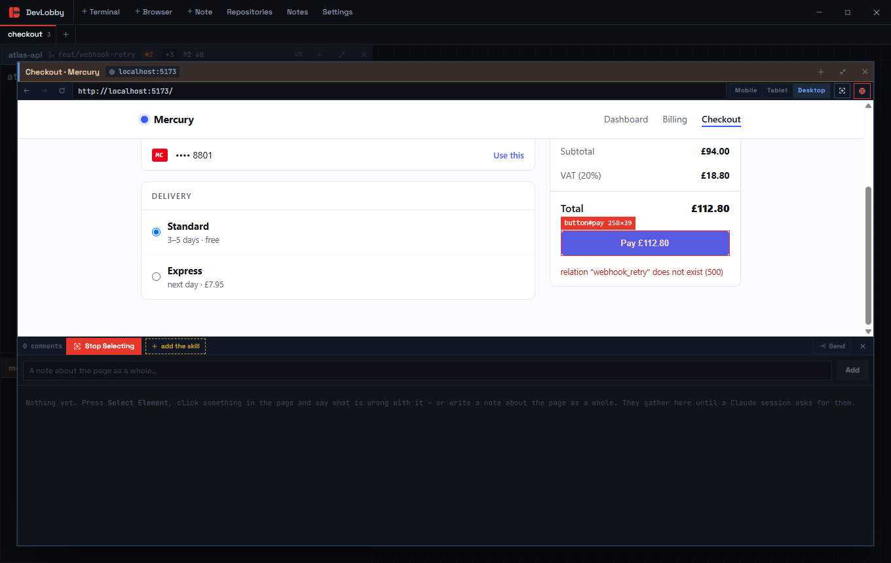
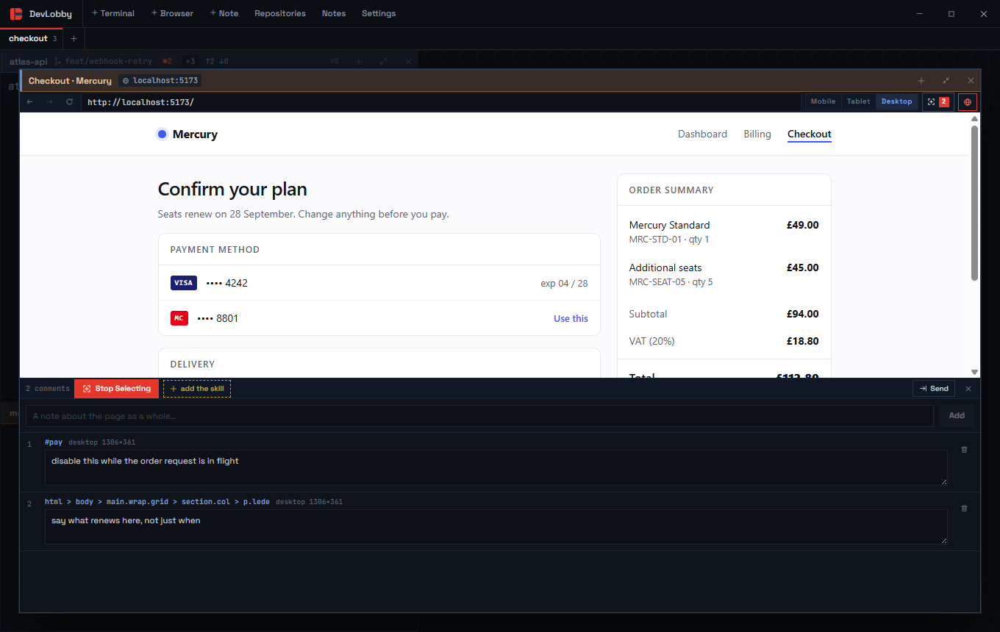
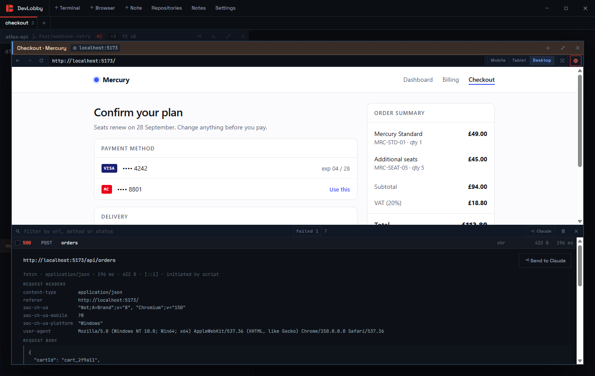
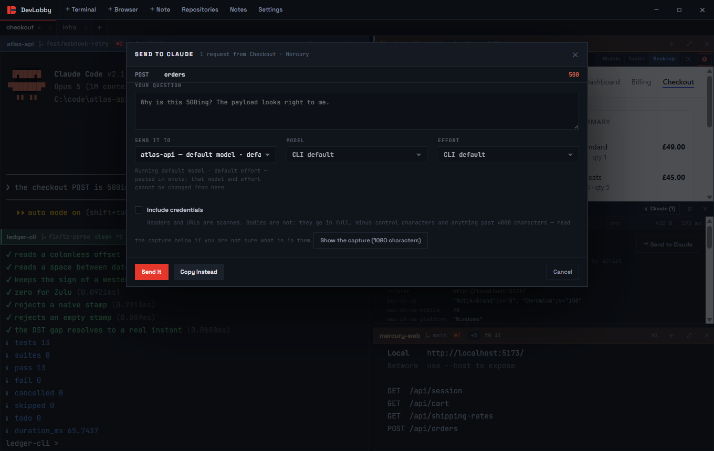

<div align="center">


# DevLobby

**A repo-aware tiled workspace for terminals, browsers, and AI coding sessions.**

[](https://github.com/Amitoj02/devlobby/releases)
[](#install)
[](https://www.electronjs.org/)
[](https://react.dev/)
[](https://www.typescriptlang.org/)
[](./LICENSE)
[](https://claude.com/claude-code)



</div>

Every pane knows the repository it sits in and what that repository's working
tree is doing. When one needs you — it rang the bell, or went quiet on a
question — it glows red and the taskbar flashes, so you can leave the whole
grid running while you get on with something else.

A pane can also be the page you are building. It tiles like the rest, keeps a
log of every request the page makes, and any one of those requests goes to a
Claude session two panes over with a note attached.

Windows only.

|  |  |
|---|---|
| [**Build the grid**](#build-the-grid) | drag a pane onto another to split, drag the gutters to resize, `⤢` to fill the window |
| [**Read a pane**](#reading-a-pane) | branch, dirty count, untracked count and upstream drift, in the header |
| [**Get told**](#when-a-pane-needs-you) | a pane that wants you glows red and counts towards `N waiting` in the titlebar |
| [**Mark a page up**](#marking-a-page-up) | point at an element, say what is wrong, hand the lot to a Claude session |
| [**Read the traffic**](#the-network-log) | every request the page made, and the whole exchange for any of them |
| [**Undo a close**](#closed-one-by-mistake) | `Ctrl+Shift+T` brings the pane back still running, not restarted |

---

## Install

Grab `devlobby-<version>-setup.exe` from the
[Releases page](https://github.com/Amitoj02/devlobby/releases) and run it. It
installs to your own user folder, so it never asks for admin, and it adds Start
Menu and desktop shortcuts. There is a portable `.exe` there too — one file, no
install, no shortcuts.

Or build it yourself:

```bash
npm install
npm run build:win     # installer and portable, into release/<version>/
```

Your repositories, notes and layout live in `%APPDATA%\DevLobby`. Uninstalling
leaves them alone.

## Start here

**1. Declare your repositories.** `Repositories` in the titlebar, then
`Add repository` for one folder — or `Scan folder` to point DevLobby at the
directory your projects live in and take them all at once. Dropping a folder
anywhere on the window works too.



**2. Say what each one opens with.** The `⋯` button on a repository row opens
its settings:

| | |
|---|---|
| **Command on open** | typed into every new terminal here — set it to `claude` |
| **Press Enter for me** | actually run that command, rather than just typing it |
| **Colour** | tints the header of every terminal on this repository |
| **Shell** | overrides the default shell for this repository |
| **Where it runs** | a browser pane opened here starts on this URL |

**3. Open terminals.** `+` on a repository row, or `＋ Terminal` in the titlebar,
which drops down the list of repositories so you can say which one — plus
`Choose a folder…` for somewhere you have not declared. `Ctrl+Alt+T` skips the
menu and reuses the focused pane's repository. `＋ Browser` opens a browser pane
on the same project.

## Build the grid

Drag a pane by its header onto another pane; the half you hover over becomes
the split. Drop it in the middle to swap the two. Drag the gutters between
panes to resize. `⤢` fills the window with one pane, and `Esc` puts it back.



Nothing restarts while you rearrange. The shell behind a terminal and the page
behind a browser pane both survive being moved, because a pane changes address
rather than being rebuilt.

## Tabs

The row under the titlebar is one entry per grid. A tab is a whole grid of its
own — its own panes, its own splits, its own zoom — so you can keep one laid
out for the thing you are shipping and open another for the thing that just
came in, without taking the first one apart.

Nothing in a tab stops when you leave it. Shells keep running, terminals keep
their scrollback, browser panes keep the page they were on, and a pane that
starts wanting you puts a red dot on its tab and counts towards the `N waiting`
in the titlebar — click that and DevLobby brings the right grid forward on its
own.

`+` opens a new one. Double-click a tab to name it, drag it along the strip to
reorder it, and drag a *pane* by its header onto a tab to move it into that
grid — nothing restarts, exactly like dragging one across a grid.

`Ctrl+Alt+Shift+T` opens a grid, `Ctrl+PageUp` / `Ctrl+PageDown` move between
them, `Ctrl+Alt+Shift+W` closes one. Closing a grid is undoable for five
seconds like anything else — `Ctrl+Shift+T` puts it back with everything in it
still running — and DevLobby asks first anyway when something in it is.

## Reading a pane

The header carries, in order: the repository name, the branch, a red `●N` dirty
count, a `+N` untracked count, and `↑N ↓N` against the upstream. `clean` in
green means nothing to commit. A narrow pane drops these from the right as it
shrinks — the name and the dirty count are the last to go.

Give a repository a colour and every terminal opened on it wears that colour in
its header, which is the fastest way to pick one project out of a wall of
near-identical panes.

## When a pane needs you

A pane that rings the bell, or goes quiet on a question while you are looking
elsewhere, glows red and grows a `NEEDS YOU` badge, and the titlebar shows
`N waiting` — click that to jump straight to it. If DevLobby itself is behind
another window, its taskbar button flashes and the window title becomes
`N waiting - DevLobby`.



## Closed one by mistake

`Ctrl+Shift+T` brings back the last thing you closed. For five seconds after a
close nothing behind it has actually stopped, so you get the same thing back
rather than one that looks like it:

- **A terminal** comes back with its shell still running and its scrollback
  intact, in the same slot in the grid.
- **A browser pane** comes back on the same page — not reloaded. The scroll
  position, whatever you had typed into it, its network log and any comments
  you had written on it are all still there.
- **A whole grid**, if a tab is what you closed. It goes back in the same place
  on the strip with every pane in it still running.

Press it again to walk further back through anything else you closed inside
that window. After five seconds it is properly gone.

## The browser

`＋ Browser` — or `Ctrl+Alt+G` — puts a page in the grid, next to the terminal
that is building it. Type `:5173` in the bar and it goes to your dev server;
`/checkout` goes to that path on the page you are already on. It reloads,
it goes back and forward, and `⤢` fills the window with it.

`Mobile` and `Tablet` lay the page out at 390 and 834 CSS pixels — with a
matching user agent, touch events and pixel ratio, not just a narrow window —
and scale the result down to fit the pane. `Desktop` gives the page the whole
pane. Split a browser pane and you get the same page twice, which is how you
put a layout next to itself at two widths.

The two buttons after the device switch are the ones that get work done: `⌖`
points at an element, `NET` opens the network log.

### Links that want a new tab

A pane has no tabs, and a page in one is not allowed to open a window — so a
`target="_blank"` link asks you instead. **Open in a new pane** gives the link
a browser pane of its own next to the one you were on, keeping the page you
were reading; **Ignore it** does nothing; and **Not for 5 minutes** stops that
pane asking at all for a while, which is what you want on a site that opens a
tab every time you touch it.

### Marking a page up

The `⌖` button opens the pane's comments, and `Select Element` turns the
selector on. Hover and every element under the cursor is outlined with its tag
and size; click one and a box opens over the page for you to say what is wrong
with it. `Enter` adds the comment.



The selector **stays on**. Adding a comment puts you straight back into
pointing, because marking a page up is a run of remarks and not one — it is off
when you press `Esc`, press `Stop Selecting`, or press `⌖` in the toolbar,
which puts the selector and the comments away together in one press.

For a single remark there is no mode to enter at all: **hold `Ctrl` over the
page** and the same crosshair appears, click and the comment box opens over
what you pointed at. It is one comment and then it is over — let go of `Ctrl`
and the page is a page again. That is the one to reach for when you notice a
thing wrong in passing; `Select Element` is the one for a sitting.

Not everything is about one element, so the list also takes a plain note about
the page as a whole.



Comments stay in the pane behind a count on that button. Nothing is sent, and
there is nothing to decide at the moment of writing — you mark the page up at
your own pace, editing or deleting as you go.

They are also **kept**. They go to the state file with everything else, so they
survive quitting DevLobby and come back with the pane on the next launch; and a
pane still holding comments nobody has collected asks before it closes, because
a page you have marked up is the one thing in a browser pane that reloading
cannot get back.

Each one carries what an argument about layout actually turns on: a CSS path
back to the element, where it sits and how big it is, its text, its markup, and
the computed styles that matter — `display`, `position`, the box, the flex and
grid properties, type and colour. Not the six hundred declarations a browser
will happily give you.

### Handing them to Claude

The comments bar carries `add the skill` when the `/devlobby-browser` skill is
missing from your machine, or `update the skill` when the copy you have was not
written by this build of DevLobby. Press it and DevLobby writes both halves —
the skill and the script it runs — into `~/.claude/skills/devlobby-browser/`.
The button is gone once they match, because there is then nothing to do about
it.

In any Claude session, anywhere on the machine, run:

```
/devlobby-browser
```

It arms the picker in the browser pane you last used and then waits. Mark the
page up, press `Send` in the pane, and the comments arrive in that session,
which then goes and fixes them. They are cleared from the pane once taken, so
nothing is sent twice.

The order does not matter: comment first and run the skill afterwards if you
prefer — the send button is always there, and it says when a session is
waiting. If no browser pane is open, the skill fails and says so rather than
waiting for something that cannot happen.

The skill lives in `~/.claude/skills/devlobby-browser/`, and ships with
DevLobby in [`resources/skills/`](./resources/skills) so the two halves cannot
drift apart. It finds DevLobby through a loopback port and token that DevLobby
writes to `%APPDATA%\DevLobby\bridge.json` while it runs, so it works wherever
DevLobby was started from — and stops working the moment DevLobby does.

### The network log

`NET` opens a log of everything the page has asked for: status, method, path,
type, size and time, newest first, with a count that turns red when something
failed. Filter it, or tick *failed* for just the 4xx, 5xx and never-arrived.
Click a row to open the whole exchange — request headers, request body,
response headers, response body.



The log survives a reload on purpose, so a request that only fails on the way
in is still there afterwards. `Clear` empties it.

### Sending one to Claude

Tick the requests you care about and press `Claude`, or open a row and use
`Send to Claude`. Write what you actually want to know, and DevLobby formats
the exchange underneath it and pastes the lot into a session:



- **A session already running** gets it pasted in, without a trailing newline —
  you read it back and press Enter yourself. It answers with whatever `--model`
  and `--effort` that session was started with, because nothing pasted into a
  running CLI can change those. The dialog says which, read out of the command
  the terminal was opened with.
- **A new session** is started for you with the model and effort you pick,
  defaulting to the ones in `Settings`, or to the repository's own
  `Command on open` when that is already a `claude` command.

Credentials are taken out of the headers and the URLs first — `authorization`,
`cookie`, `set-cookie`, API-key headers, tokens in a query string — and the
dialog says how many. Request and response bodies are sent whole, because a
body is usually the thing you are asking about; `Show exactly what is sent`
prints the text before it goes anywhere, and `Copy instead` puts it on the
clipboard rather than in a pane. Tick *Include credentials* when the auth
header is the bug.

Two cases get one line naming a file in `%APPDATA%\DevLobby\captures\` instead
of the capture itself: anything longer than about nine thousand characters,
which the CLI would fold into a placeholder that can expire; and any pane where
DevLobby did not itself start Claude and watch it take the Enter — a multi-line
paste into a bare shell is not one message, it is a stack of commands sitting
on the prompt. The dialog says which of the two is about to happen, in the line
under the target.

That is stricter than it looks. A repository's `Command on open` is typed into
every terminal it opens whether or not *Press Enter for me* is set, so a pane
can be configured for `claude` and still be sitting at a shell prompt —
DevLobby goes by what actually ran, notices when a CLI exits and hands the
terminal back, and checks that the program in the pane is accepting pastes at
the moment you press Send.

## Notes

`＋ Note` opens a scratchpad that tiles and persists exactly like a terminal.
Draft a prompt, then `Ctrl+Enter` (or the send button) pastes it into the
terminal you were last in — *without* a newline, so you read it back and press
Enter yourself. Closing a note's pane keeps the note; `Notes` in the titlebar
lists everything you have kept, and reopens it.

## Settings

`Settings` in the titlebar, saved as you change them: font and size, the
default shell, how long a pane has to stay quiet before it counts as "needs
you", whether closing a busy pane asks first, how much of the last session
comes back when you launch, how many requests a browser pane keeps, and the
model and effort DevLobby starts a Claude session with when you ask it to.

## Keyboard

Nothing uses a plain `Ctrl` letter: Claude and every other CLI keep those to
themselves, `Esc` included. The zoom and page keys are the only exceptions, and
no CLI binds either.

| | |
|---|---|
| `Ctrl+Alt+T` / `N` / `G` | new terminal / new note / new browser pane |
| `Ctrl+Alt+Shift+T` / `W` | new grid, in its own tab / close this grid |
| `Ctrl+PageUp` / `PageDown` | previous / next grid |
| `Ctrl+Alt+D` / `S` | split the focused pane right / down |
| `Ctrl+Alt+W` | close the focused pane |
| `Ctrl+Shift+T` | bring back the pane, or the grid, you just closed |
| `Ctrl+Alt+Z` | fill the window, and back again |
| `Ctrl+Alt+←↑→↓` | move focus that way |
| `Ctrl+Alt+1…9` | focus pane N, in reading order |
| `Ctrl+Alt+E` | even out every split |
| `Ctrl+Alt+O` | open the focused pane's folder in VS Code |
| `Ctrl+Alt+R` or `Ctrl+Alt+P` | repositories |
| `Ctrl+Alt+B` | notes |
| `Ctrl+Alt+,` / `Ctrl+Alt+/` | settings / the full list |
| `Ctrl+Shift+C` / `V` | copy selection / paste |
| `Ctrl+Shift+F` / `K` | find in terminal / clear |
| `Ctrl+=` `Ctrl+-` `Ctrl+0` | font size |

## If something goes wrong

**Windows blocked DevLobby.exe.** Smart App Control is enforced on some
machines and judges each binary by its hash, so an unsigned build that ran yesterday can be
blocked today with *"An Application Control policy has blocked this file"*. If
you built from source, `devlobby.cmd` runs the same app through Electron's own
signed binary and is unaffected.

**`Ctrl+Alt+R` does nothing.** It is a popular global hotkey — screen recorders
claim it most often — so something else got there first. `Ctrl+Alt+P` opens
repositories too.

**A terminal opened but nothing runs in it.** Check `Settings → Default shell`;
if the shell it points at is not installed on this machine, pick one that is.

**A browser pane stopped logging requests.** Only one debugger can be attached
to a page at a time, and opening Chrome DevTools on it takes ours. The log says
so and offers `Reattach`; close DevTools first.

---

MIT licensed — see [LICENSE](./LICENSE). The bundled fonts are SIL OFL 1.1;
their licences are in [`licenses/`](./licenses).

Want to work on DevLobby rather than just use it?
[CONTRIBUTING.md](./CONTRIBUTING.md) has the architecture, the checks, and the
handful of decisions worth knowing before changing anything.
